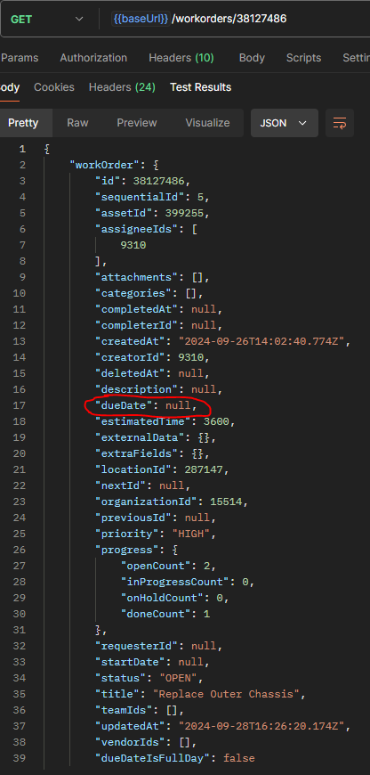

It is entirely possible to assign a due date to a work order based on the work order priority using MaintainX's API. 
In order to achieve this I created a Flask app in Python which has an endpoint callable by MaintainX's webhook on creation of a New Work Order.

The basic steps of my codes logic are as follows: 

1. Webhook Trigger:
MaintainX triggers a webhook to my Flask application’s /set-priority endpoint whenever a new work order is created.
The webhook payload contains essential work order details, such as id and priority as per MaintainX API documentation.

2. Receive and Process Data:
The Flask app receives the webhook payload and extracts the id and priority of the newly created work order.

3. Calculate Due Date:
Based on the provided priority, the application calculates an appropriate due date using predefined logic. This logic can be modified to any use case but I used the following:
High Priority: Due in 1 days
Medium Priority: Due in 3 days
Low Priority: Due in 7 days

4. Update Work Order:
My app then makes a POST request to the MaintainX API (/workorder/{id}) to update the due date of the newly created work order with the calculated value.

I'd also like to showcase that this logic indeed works. The following image is a GET response for an existing work order that I created in a MaintainX sandbox environment:
### **Existing Work Order**

  

When the /set-priority endpoint is triggered and runs successfully it returns:
### **App Response:**

  

And finally, when retrieving the same work order from MaintainX's API, we can see the due date has been created:
### **Updated Work Order Due Date:**

  

I also created a software flow diagram to provide an in-depth look into the logic required for this functionality to be possible. Please Enjoy!

### **Flow Diagram:**

  

